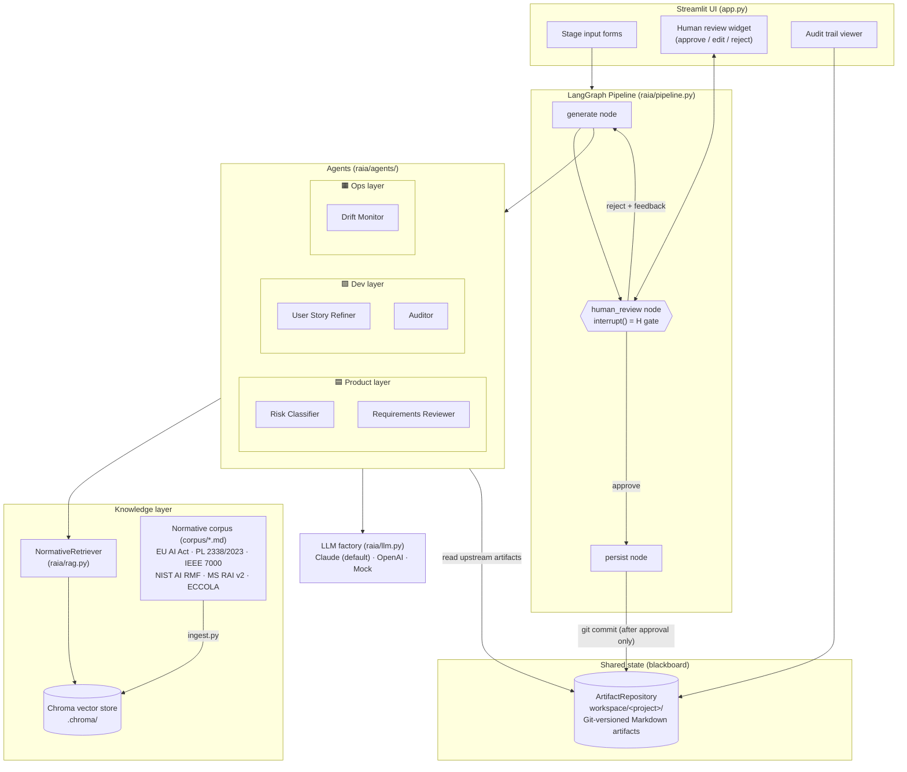
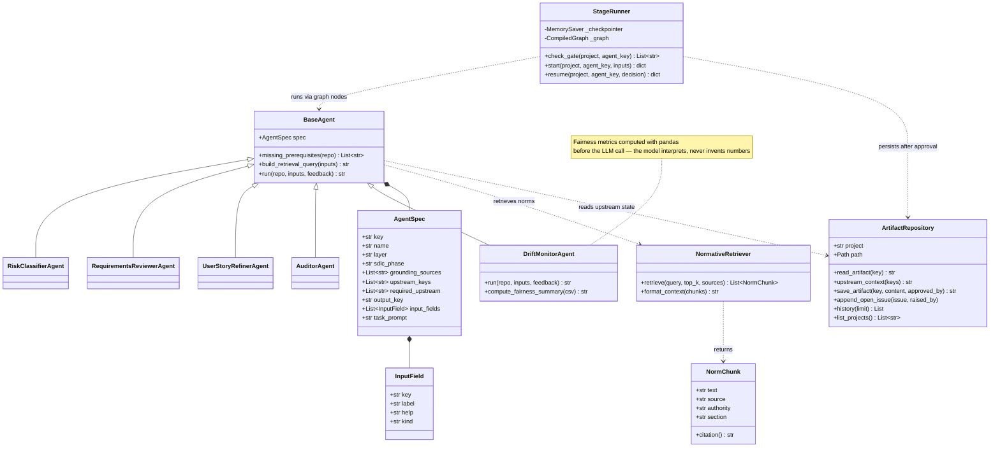
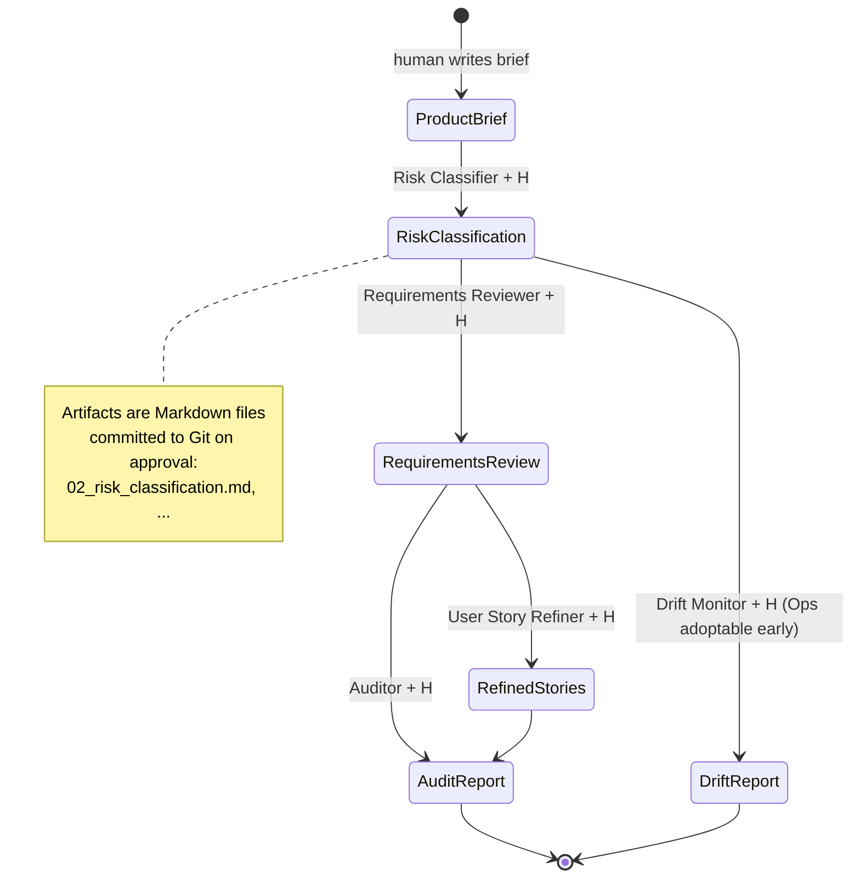

# RAIA — Architecture & UML Diagrams

This document describes the structure of the RAIA proof of concept and maps
it back to the paper *"RAIA: A Multi-Agent Architecture to Operationalize
Responsible AI across the Software Development Life Cycle"*. All diagrams
are in Mermaid and render natively on GitHub.

## 1. Component Diagram (system overview)

Five agents in three layers communicate **exclusively** through the
Git-versioned shared artifact repository (blackboard). Every agent output
passes a mandatory human checkpoint (H) before persistence.



## 2. Class Diagram (code structure)



## 3. Sequence Diagram (one agent run with the human checkpoint)

```mermaid
sequenceDiagram
    actor Human
    participant UI as Streamlit UI
    participant SR as StageRunner (LangGraph)
    participant AG as Agent
    participant RAG as NormativeRetriever
    participant LLM as LLM (Claude)
    participant REPO as ArtifactRepository (Git)

    Human->>UI: fill stage inputs, click Run
    UI->>SR: start(project, agent_key, inputs)
    SR->>SR: check stage gate (required upstream artifacts)
    SR->>AG: generate node → run(repo, inputs)
    AG->>REPO: read upstream artifacts (blackboard)
    AG->>RAG: retrieve(query, sources=grounding)
    RAG-->>AG: norm excerpts + citations + authority levels
    AG->>LLM: system + task prompt + excerpts + upstream + inputs
    LLM-->>AG: draft (every claim cited)
    AG-->>SR: draft
    SR-->>UI: interrupt() — awaiting_review (H gate)
    UI-->>Human: show editable draft

    alt Human rejects
        Human->>UI: feedback
        UI->>SR: resume({action: reject, feedback})
        SR->>AG: regenerate with feedback
        AG-->>SR: new draft
        SR-->>UI: awaiting_review again
    else Human approves (possibly edited)
        Human->>UI: approve (name recorded)
        UI->>SR: resume({action: approve, content, approver})
        SR->>REPO: save_artifact() → git commit
        REPO-->>SR: commit hash
        SR-->>UI: approved + commit
        UI-->>Human: artifact committed; downstream gate opens
    end
```

## 4. Pipeline / State Diagram (SDLC-wide stage gates)

Agents never trigger each other; a stage only unlocks when the human has
approved the upstream artifact it requires.



## 5. Design Decisions (traceability to the paper)

| Paper element | Implementation |
|---|---|
| Five agents, three layers (Table 2) | `raia/agents/` — one module per agent; `AGENTS` registry in pipeline order |
| Blackboard shared state, Git-versioned (§3.3) | `raia/repository.py` — every approval = one local Git commit; approval provenance stamped in the artifact header |
| Mandatory human checkpoints "H" (§3.4a) | LangGraph `interrupt()` in the `human_review` node; persistence unreachable without an approve decision |
| Grounded recommendations via RAG (§3.4b) | `raia/rag.py` — Chroma; every chunk carries source/section/authority metadata; agents must cite excerpt tags |
| Conflict precedence legal > standard > advisory (§3.4c) | Authority levels in `config.AUTHORITY_LEVELS`, enforced in the shared system preamble; same-level conflicts routed to "Open Issues" |
| Data protection (§3.4d) | Artifacts stay in local `workspace/`; nothing leaves the machine except LLM API calls; no retraining |
| Provider-agnostic LLM (§3.3) | `raia/llm.py` factory — Claude default, OpenAI or mock via one env var |
| Anti-ethics-washing Auditor (§5) | Auditor prompt forbids "satisfied" verdicts without quoted evidence from versioned artifacts |
| Hallucination-free metrics (Ops) | Drift Monitor computes fairness numbers with pandas; the LLM only interprets |

**Not yet implemented** (future work tracked in the README): Jira/Confluence
MCP connectors, and the input-sanitization / least-privilege hardening noted
in §3.4e beyond prompt-level instructions.
