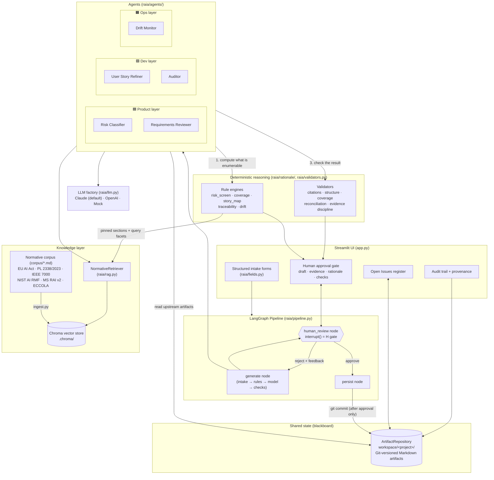
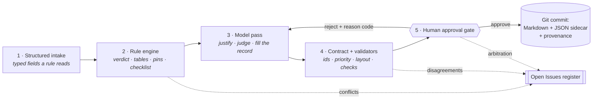
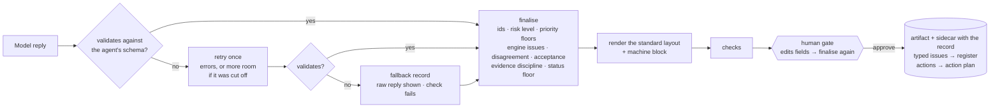
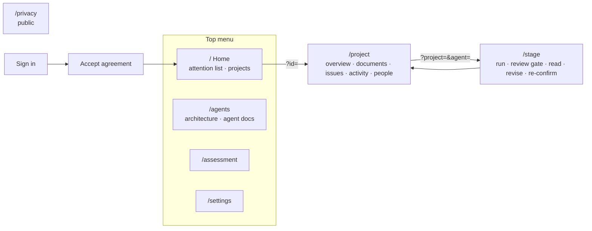
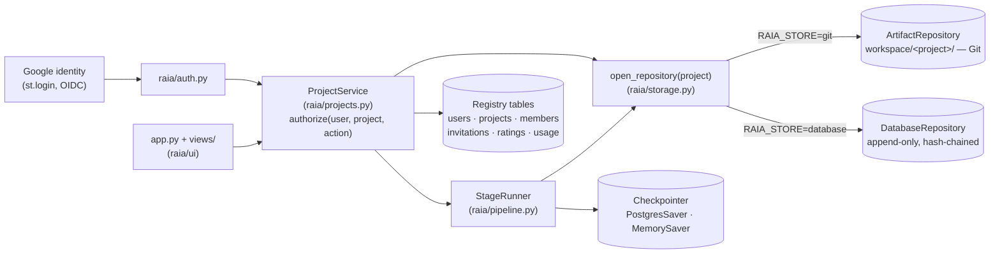
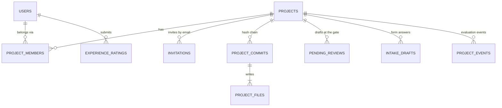
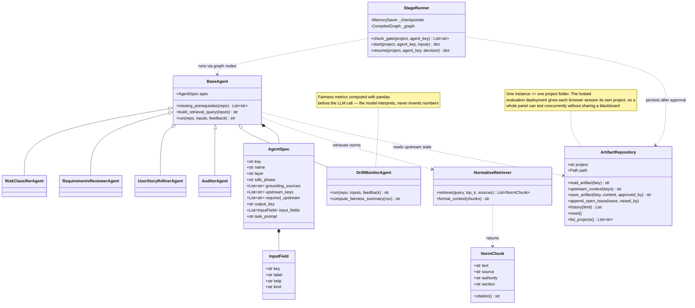
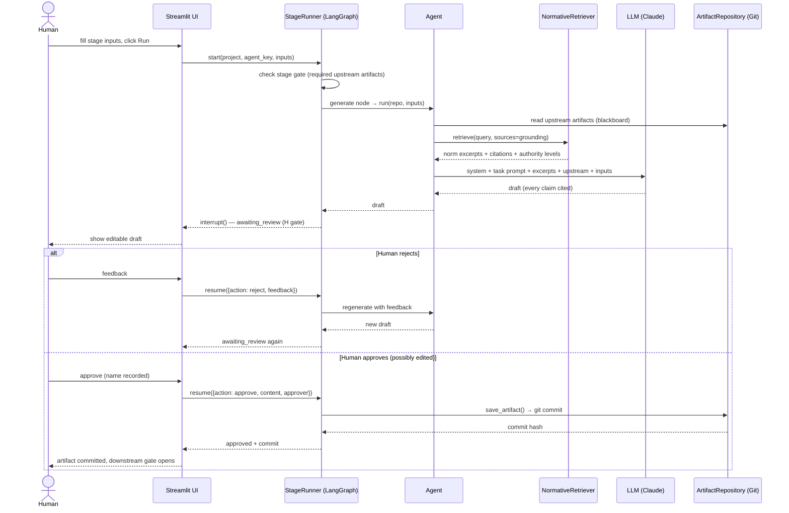
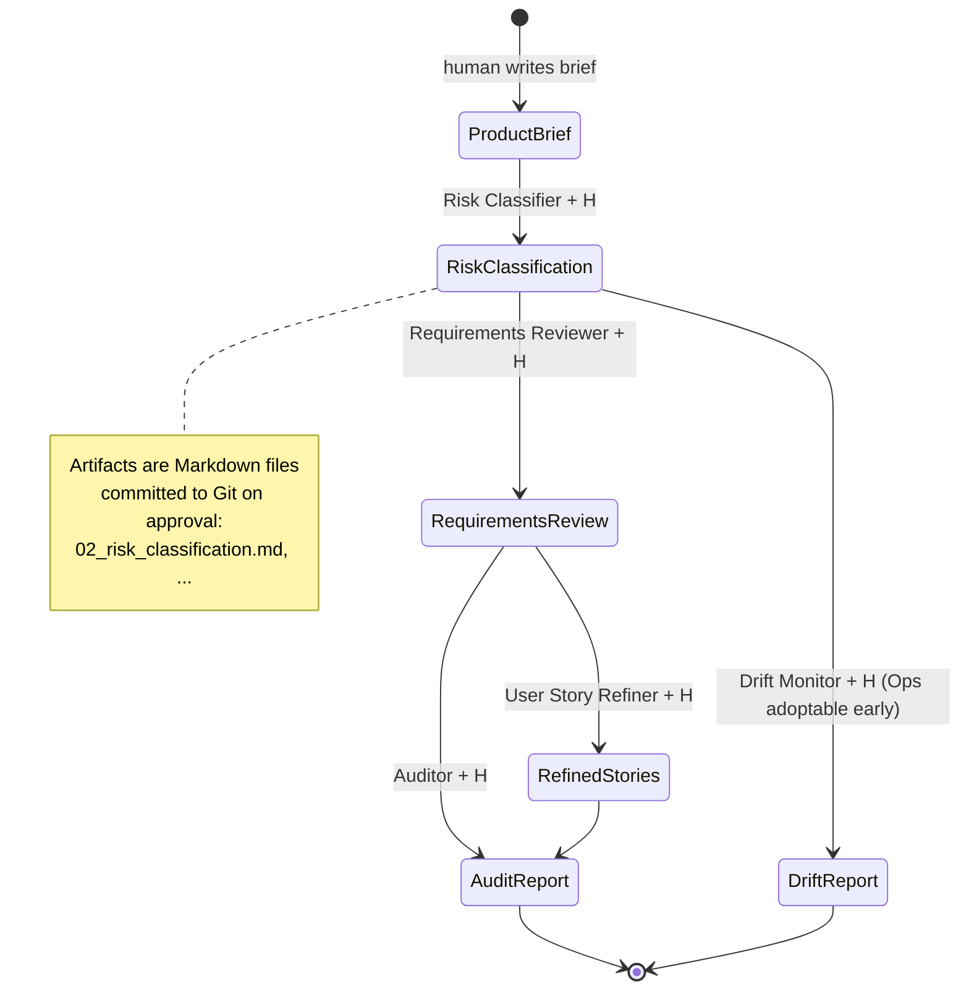

# RAIA — Architecture & UML Diagrams

This document describes the structure of the RAIA proof of concept and maps
it back to the RAIA architecture as specified in the master's research
project it implements. All diagrams are in Mermaid and render natively on
GitHub.

## 1. Component Diagram (system overview)

Five agents in three layers communicate **exclusively** through the
Git-versioned shared artifact repository (blackboard). Every agent output
passes a mandatory human checkpoint (H) before persistence.

## 1b. The Agent Turn (where the reasoning happens)

Every agent runs the same five-step turn. Steps 1, 2 and 4 are deterministic;
only step 3 calls a model, and step 5 is a person. This is the generalisation
of the one place in the earliest version where a claim was enforced by code
rather than requested in a prompt.

**The division of labour is the point.** Prohibition lists, high-risk area
lists, obligation tables, coverage matrices, traceability registers and metric
thresholds are enumerable, so they are computed. Whether a narrow-task
exemption really holds, whether a harm is significant, whether a lexical match
is real evidence — those are open-textured, so they are argued by the model and
settled by a person. Where the two disagree, neither wins silently: the
disagreement is recorded as an open issue.

**Every turn ends in the same record.** The model's reply is one JSON object
validated against the agent's schema (`raia/contract/`): a shared core —
summary, findings placed on likelihood and magnitude, actions, typed open
issues, declared coverage — and an extension shaped by the agent's normative
source. Code assigns the identifiers, computes risk level and priority,
carries the engine's issues forward, and renders the one layout every artifact
follows. A reviewer edits the record's fields at the gate, never its prose.
The standard is specified in `docs/output-contract.md`.

## 1b′. Interface: page map

The interface is a set of pages behind a top menu (`app.py` registers them with
`st.navigation`; the map is documented in `raia/ui/routes.py`).

Project progress, including the *Needs review* flag, is derived on every load
by `raia/lineage.py` from the blackboard and the event log: an approved stage
needs review when a stage it depends on (through `upstream_keys`, transitively)
was approved after it was last approved or re-confirmed. Nothing is re-run.

## 1c. People, Projects and Storage

The blackboard belongs to a **project**, and a person reaches a project only
through a membership. Every project operation — reading, running an agent,
approving, arbitrating, inviting, exporting — goes through one authorization
check in `ProjectService`, below the UI.

| Role | View | Run agents, edit answers | Approve / reject, arbitrate | Invite, settings, delete |
|---|---|---|---|---|
| owner | ✓ | ✓ | ✓ | ✓ |
| editor | ✓ | ✓ | ✓ | |
| reviewer | ✓ | | ✓ | |

Three rules the tests enforce:

- **Stage is derived, never stored.** A project's progress is computed from
  its approved artifacts and pending drafts on every read.
- **Identity comes from the session.** The approver recorded at a gate is the
  signed-in person; any approver name in the caller's payload is overwritten.
  With *require a second approver* set, the person who ran a stage cannot
  approve it — including after a restore.
- **History is tamper-evident on both backends.** Git objects locally; in the
  database each version's digest covers its parent digest, its message, its
  timestamp and the SHA-256 of every file it wrote, and `verify_history()`
  recomputes all of them.

## 2. Class Diagram (code structure)

## 3. Sequence Diagram (one agent run with the human checkpoint)

## 4. Pipeline / State Diagram (SDLC-wide stage gates)

Agents never trigger each other; a stage only unlocks when the human has
approved the upstream artifact it requires.

## 5. Design Decisions (traceability to the RAIA architecture)

| Architecture element | Implementation | Enforced by |
|---|---|---|
| Five agents, three layers | `raia/agents/` — one module per agent; `AGENTS` registry in pipeline order | structure |
| Blackboard per project, versioned | `raia/repository.py` (Git) and `raia/storage.py` (hash-chained database); every approval is one recorded version carrying the Markdown artifact *and* its JSON sidecar; approval provenance stamped in the header | code |
| Mandatory human checkpoints "H" | `interrupt()` in the `human_review` node; the persist node is unreachable without an approve decision, including on the restart-recovery path | code + smoke test |
| Agents never trigger agents | stage gates via `AgentSpec.required_upstream`; no agent-to-agent call exists | structure |
| Grounded recommendations | `raia/rag.py` — excerpts carry source, section, authority and a stable id; agents must cite them | prompt |
| Citations are real | `validators.check_citations` matches every tag against the excerpts actually retrieved for that run | code |
| The decisive excerpt is never missing | each decision procedure declares `Pin`s, fetched by exact metadata match and merged ahead of similarity results | code + smoke test |
| Decision procedures, not prompts | `raia/rationale/` — one rule engine per agent computes the verdict, the tables and the identifiers before any model call | code |
| Verdicts are reconciled, not averaged | `validators.check_reconciliation` requires the agent to declare agreement or disagreement; disagreement becomes an open issue | code |
| Conflict precedence legal > standard > advisory | `config.AUTHORITY_LEVELS`, reinforced by excerpt ordering in the prompt | prompt |
| Same-level conflicts escalated | `ArtifactRepository.append_open_issues` — a tracked register with statuses, populated from both the engine and the approved draft | code |
| Declared completeness | each engine emits a checklist; `validators.check_coverage` requires a status per key | code |
| Anti-ethics-washing audit | `rationale/traceability.py` assigns NOT VERIFIED where no evidence exists; `validators.check_forbidden_verdicts` prevents an upgrade | code |
| Metrics come from code | `rationale/drift.py` computes every figure; `validators.check_numbers` rejects any number not in the computed set | code |
| One standard output for every agent | `raia/contract/` — schema per agent (shared core + extension), closed vocabularies from the normative sources, code-computed identifiers, risk level and priority, one rendered layout, bounded repair and an honest fallback; published in `docs/schema/` and `docs/output-contract.md` | code + test_contract |
| Every identified risk is responded to | `contract.checks.check_responses` — every finding has an action or an open issue; accepting a risk opens an issue | code |
| Structured human editing | the gate edits record fields; persistence re-finalises, re-renders and re-validates what was approved; free-text edits are refused | code + smoke test |
| Project action plan | `contract.actions` — every action from every approved record, sorted by computed priority, exported as CSV/JSON | code |
| Reproducible audit trail | `raia/provenance.py` — model, temperature, corpus version, excerpt ids, prompt hash, attempt, edits, rejection history, check results | code |
| Data protection | projects are reachable only through a membership, checked in `ProjectService.authorize`; sign-in delegated to Google (no stored passwords); research exports pseudonymized with keyed participant codes; no retraining | code + test_projects |
| Accountable approval | the approver is the authenticated identity; optional second-approver rule makes the runner ineligible to approve | code + test_projects |
| Durable review state | `PostgresSaver` checkpointer and stored drafts; a restored review re-enters the gate | code + test_projects |
| Input sanitization | `raia/sanitize.py` — control characters, length caps, injection patterns in English and Portuguese; applied to form input *and* to the approved artifact | code |
| Provider-agnostic LLM | `raia/llm.py` factory and a single `invoke_chat` call site | structure |

**Not yet implemented** (tracked in the README roadmap): ingesting the official
legal texts with article-level citation metadata, Jira/Confluence MCP
connectors, and least-privilege tool-permission hardening.

**Known limitations, stated plainly.** The corpus is a set of curated summaries
prepared for this project, so a citation resolves to a section of a summary
rather than to the official wording; sources in `config.DERIVED_SOURCES` are
labelled as such in the prompt and at the approval gate. Injection detection is
regex-based and will not catch a careful paraphrase — the controls that carry
the weight are the approval gate and the citation validator, not the pattern
list. The lexical matchers in the coverage and traceability engines are
deliberately coarse and conservative: they produce candidate gaps and
conservative verdicts for a human to review, and are not evidence of absence.
